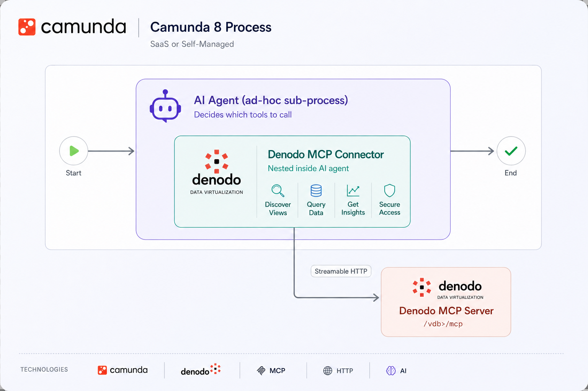

# Denodo MCP Connector for Camunda

Connect a Camunda 8 AI Agent to a [Denodo](https://www.denodo.com/) Virtual DataPort database via Denodo's built-in [MCP server](https://community.denodo.com/docs/html/browse/latest/en/vdp/developer/model_context_protocol_mcp/model_context_protocol_mcp), so the agent can discover and query Denodo views as tools — in natural language, with no custom code.



---

## What this connector does

- Wraps Camunda's built-in **MCP Remote Client** connector with Denodo-specific defaults, field labels, and branding — no custom backend code
- Lets an AI Agent discover and call Denodo views (via Denodo's MCP server) as tools, based on natural-language questions
- Supports **Basic** and **OAuth 2.0** authentication, matching however your Denodo administrator has configured the MCP server
- Ships as a standard Camunda **element template**, installable in both Desktop and Web Modeler

## Repository contents

| File / folder | Purpose |
|---|---|
| [`element-templates/denodo-mcp-connector-template.json`](element-templates/denodo-mcp-connector-template.json) | The Camunda element template. Install this to add "Denodo MCP Connector" as a task type in Modeler. |
| [`denodo_mcp_agent_example.bpmn`](denodo_mcp_agent_example.bpmn) | A minimal, correctly-structured example process. Start here — see [Example](#example) below. |
| `img/` | Screenshots referenced by this README. |
| `README.md` | This file. |

## Prerequisites

- Camunda 8.9 or later (Camunda 8 SaaS, or Self-Managed with the agentic AI connectors enabled)
- A Denodo Virtual DataPort instance with MCP enabled ([Denodo MCP server docs](https://community.denodo.com/docs/html/browse/latest/en/vdp/developer/model_context_protocol_mcp/model_context_protocol_mcp))
- Network reachability between your Camunda connector runtime and your Denodo MCP endpoint

## Installation

### Desktop Modeler
1. Download [`element-templates/denodo-mcp-connector-template.json`](element-templates/denodo-mcp-connector-template.json) from this repo
2. Copy it into your local element templates folder:
   - **Windows:** `%APPDATA%\camunda-modeler\resources\element-templates\`
   - **macOS:** `~/Library/Application Support/camunda-modeler/resources/element-templates/`
   - **Linux:** `~/.config/camunda-modeler/resources/element-templates/`
   (create the `resources/element-templates` folders if they don't already exist)
3. Fully restart Camunda Modeler
4. Append a new task inside your AI Agent ad-hoc sub-process, search "Denodo," select **Denodo MCP Connector**

### Web Modeler
1. In your project, go to **Create new → Element template**
2. Upload `element-templates/denodo-mcp-connector-template.json`
3. It will now be available org-wide across your Web Modeler diagrams

## ⚠️ Required: this connector must be nested inside an AI Agent ad-hoc sub-process

This connector only works when placed as a **child element inside** a Camunda AI Agent ad-hoc sub-process — never as a standalone task in your main process flow. The AI Agent step itself can sit anywhere in a larger sequential process (e.g. `Task A → Task B → [AI Agent with Denodo nested inside] → Task C`); the nesting rule applies only to the relationship between this connector and its containing AI Agent step.

**Why:** this connector operates in `aiAgentTool` mode. It expects the AI Agent orchestrator to supply a `toolCall` variable (method + params) at runtime, based on the LLM's decision to invoke it. That variable is only ever set when the task is dispatched *as a tool* from inside an ad-hoc sub-process. If the task sits outside the sub-process as a regular sequential step, `toolCall` is never populated — the process will **deploy successfully** but **fail at runtime** with an empty/null tool call.

**Known Modeler UI issue:** in current versions of Camunda Modeler (tested on 5.50.1), appending this connector via drag-and-drop, the boundary "+" menu, or the internal "+" inside an ad-hoc sub-process may place it as a **sibling task connected by a sequence flow**, rather than as a true nested child — even when clicking inside the sub-process boundary. This is a Modeler UI behavior, not a configuration mistake on your part.

**How to check:** open your diagram's XML (Modeler's "Edit as XML" / text view). The connector's `<bpmn:serviceTask>` element must appear **between** the opening and closing tags of the `<bpmn:adHocSubProcess>` element — not as a sibling `<bpmn:serviceTask>` joined to the sub-process by a `<bpmn:sequenceFlow>`.

Correct:
```xml
<bpmn:adHocSubProcess id="Activity_AiAgent" ...>
  <bpmn:extensionElements>...</bpmn:extensionElements>
  <bpmn:serviceTask id="Activity_QueryDenodo" zeebe:modelerTemplate="com.denodo.connectors.mcp.remoteclient.v1" ...>
    ...
  </bpmn:serviceTask>
</bpmn:adHocSubProcess>
```

Incorrect (will deploy, will fail at runtime):
```xml
<bpmn:adHocSubProcess id="Activity_AiAgent" ...>
  <bpmn:outgoing>Flow_ToConnector</bpmn:outgoing>
</bpmn:adHocSubProcess>
<bpmn:serviceTask id="Activity_QueryDenodo" ...>
  <bpmn:incoming>Flow_ToConnector</bpmn:incoming>
</bpmn:serviceTask>
```

**If the UI won't nest it correctly:** the most reliable fix is to edit the BPMN XML directly — move the `<bpmn:serviceTask>` block (including its `<bpmn:extensionElements>`) so it sits between the sub-process's opening and closing tags, and remove the sequence flow that previously connected them. See [`denodo_mcp_agent_example.bpmn`](denodo_mcp_agent_example.bpmn) in this repo for a complete, correctly-structured reference you can copy from directly.

## Configuration reference

| Field | Description |
|---|---|
| **Transport type** | Streamable HTTP (recommended) or HTTP with SSE (legacy, deprecated by Denodo) |
| **Denodo MCP server URL** | Full URL to your Denodo MCP endpoint, in the form `https://<denodo-host>:<port>/<vdb-name>/mcp` |
| **Authentication type** | None, Basic, or OAuth 2.0 — match this to your Denodo MCP server's configured auth |
| **Username / Password** | Shown when Authentication type = Basic. Reference a Camunda secret instead of a plaintext password, e.g. `{{secrets.DENODO_PASSWORD}}` |
| **OAuth 2.0 Token URL / Client ID / Client Secret / Scope** | Shown when Authentication type = OAuth 2.0 |
| **Retries** | Job retry count on failure (default 3) |
| **Result variable** | Process variable the tool's result is written to (default `toolCallResult`) |
| **Retry backoff** | ISO-8601 duration between retries (default `PT30S`) |

## Example

See [`denodo_mcp_agent_example.bpmn`](denodo_mcp_agent_example.bpmn) — a minimal working process: a start event, an AI Agent ad-hoc sub-process with this connector correctly nested inside as its tool, and an end event.

Before deploying, replace the placeholders in the example:

| Placeholder | Where | Replace with |
|---|---|---|
| `{{secrets.OPENAI_API_KEY}}` | AI Agent model provider | Your LLM provider's API key, stored as a Camunda secret |
| `<YOUR_MODEL_NAME>` | AI Agent model provider | Your chosen model name, e.g. `gpt-4o` |
| `https://your-denodo-host.example.com:9090/sales/mcp` | Denodo MCP Connector task | Your actual Denodo MCP endpoint URL |
| `{{secrets.DENODO_USERNAME}}` / `{{secrets.DENODO_PASSWORD}}` | Denodo MCP Connector task | Your Denodo credentials, stored as Camunda secrets |

To supply a question at runtime rather than hardcoding it, set the AI Agent's **User prompt** field to a variable reference (`=userQuestion`) and pass `{"userQuestion": "your question here"}` as a process/start variable each time you run it.

## Querying multiple databases

To let the agent choose between multiple Denodo databases based on the question, add **one Denodo MCP Connector task per database**, each nested inside the same AI Agent ad-hoc sub-process, each with its own URL. Give each task a clear name and description of which database/domain it covers — the agent uses this to decide which tool to call for a given question.

## Known limitations

- **No standalone mode.** This connector is built on Camunda's **MCP Remote Client**, which only operates in agent-tool mode — it cannot be called directly from a sequential process step without an AI Agent in front of it. A human-in-the-loop confirmation step within the AI Agent sub-process can approximate more controlled behavior without full standalone support.
- **HTTP-based Denodo connections only.** Locally-run (STDIO) MCP servers are not supported by this connector; that would require Camunda's separate MCP Client connector and its own runtime infrastructure.

This is a community/partner-contributed connector, not officially maintained or supported by Camunda as part of its commercial product. For Denodo MCP server configuration questions, see [Denodo's documentation](https://community.denodo.com/docs/html/browse/latest/en/vdp/developer/model_context_protocol_mcp/model_context_protocol_mcp).

---

## Join the Denodo Community

- Star the repo
- Join the [Denodo Community](https://community.denodo.com/) and ask questions on the [Q&A](https://community.denodo.com/answers)
- Download [Denodo Developer Tier](https://community.denodo.com/denodo-platform-developer-tier)
- [Contributions](CONTRIBUTING.md) are, of course, most welcome!
- Track [issues](../../issues)

---

## Denodo MCP Connector for Camunda License

This project is distributed under the **MIT License**.

See [LICENSE](LICENSE)

---

## Denodo MCP Connector for Camunda Support

This project is supported by **Denodo Community**.

See [SUPPORT](SUPPORT.md)
